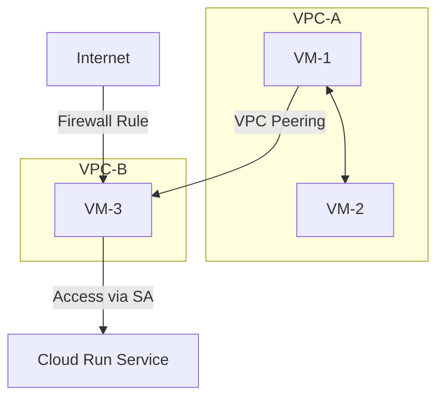

# GCP Networking and Security Lab Guide

## Lab Overview
Duration: 60-90 minutes

### Objectives
- Create custom VPC networks
- Deploy and configure VMs
- Configure firewall rules
- Set up service accounts
- Deploy a Cloud Run service
- Configure service-to-service authentication

### Architecture


## Lab Steps

## Part 1: Network Setup

1. **Create First VPC Network (vpc-network-1)**
```bash
gcloud compute networks create vpc-network-1 \
    --subnet-mode=custom \
    --bgp-routing-mode=regional

gcloud compute networks subnets create subnet-1 \
    --network=vpc-network-1 \
    --region=europe-west1 \
    --range=10.0.1.0/24
```

2. **Create Second VPC Network (vpc-network-2)**
```bash
gcloud compute networks create vpc-network-2 \
    --subnet-mode=custom \
    --bgp-routing-mode=regional

gcloud compute networks subnets create subnet-2 \
    --network=vpc-network-2 \
    --region=europe-west1 \
    --range=10.0.2.0/24
```

## Part 2: VM Creation

1. **Create VM-1 in vpc-network-1**
```bash
gcloud compute instances create vm-1 \
    --zone=europe-west1-b \
    --machine-type=e2-medium \
    --subnet=subnet-1 \
    --image-family=debian-11 \
    --image-project=debian-cloud
```

2. **Create VM-2 in vpc-network-1**
```bash
gcloud compute instances create vm-2 \
    --zone=europe-west1-b \
    --machine-type=e2-medium \
    --subnet=subnet-1 \
    --image-family=debian-11 \
    --image-project=debian-cloud
```

3. **Create VM-3 in vpc-network-2**
```bash
gcloud compute instances create vm-3 \
    --zone=europe-west1-b \
    --machine-type=e2-medium \
    --subnet=subnet-2 \
    --image-family=debian-11 \
    --image-project=debian-cloud
```

## Part 3: Network Configuration

1. **Allow internal communication in vpc-network-1**
```bash
gcloud compute firewall-rules create allow-internal-vpc1 \
    --network=vpc-network-1 \
    --allow=tcp,udp,icmp \
    --source-ranges=10.0.1.0/24
```

2. **Create VPC Peering**
```bash
gcloud compute networks peerings create peer-1-to-2 \
    --network=vpc-network-1 \
    --peer-network=vpc-network-2

gcloud compute networks peerings create peer-2-to-1 \
    --network=vpc-network-2 \
    --peer-network=vpc-network-1
```

## Part 4: Service Configuration

1. **Create Service Account**
```bash
gcloud iam service-accounts create vm3-sa \
    --display-name="VM3 Service Account"
```

2. **Deploy Cloud Run Service**
```bash
gcloud run deploy hello-service \
    --image=gcr.io/google-samples/hello-app:1.0 \
    --platform=managed \
    --region=europe-west1
```

3. **Configure Service Account Access**
```bash
gcloud run services add-iam-policy-binding hello-service \
    --member="serviceAccount:vm3-sa@${GOOGLE_CLOUD_PROJECT}.iam.gserviceaccount.com" \
    --role="roles/run.invoker" \
    --region=europe-west1

gcloud compute instances set-service-account vm-3 \
    --service-account=vm3-sa@${GOOGLE_CLOUD_PROJECT}.iam.gserviceaccount.com \
    --zone=europe-west1-b
```

4. **Create Firewall Rule for Your IP**
```bash
# Replace YOUR_IP with your actual IP address
gcloud compute firewall-rules create allow-myip-vpc2 \
    --network=vpc-network-2 \
    --allow=tcp:22,tcp:80,tcp:443 \
    --source-ranges=YOUR_IP/32
```

## Verification Steps

1. **Test Internal Network**
```bash
# From VM-1
ping -c 3 <VM-2-internal-IP>
```

2. **Test VPC Peering**
```bash
# From VM-1
ping -c 3 <VM-3-internal-IP>
```

3. **Test Cloud Run Access**
```bash
# From VM-3
curl -H "Authorization: Bearer $(gcloud auth print-identity-token)" \
    https://hello-service-xxxxx-ew.a.run.app
```

## Cleanup Commands

```bash
# Delete VMs
gcloud compute instances delete vm-1 vm-2 vm-3 --zone=europe-west1-b

# Delete firewall rules
gcloud compute firewall-rules delete allow-internal-vpc1 allow-myip-vpc2

# Delete VPC peering
gcloud compute networks peerings delete peer-1-to-2 --network=vpc-network-1
gcloud compute networks peerings delete peer-2-to-1 --network=vpc-network-2

# Delete networks
gcloud compute networks delete vpc-network-1 vpc-network-2

# Delete Cloud Run service
gcloud run services delete hello-service --region=europe-west1

# Delete service account
gcloud iam service-accounts delete vm3-sa@${GOOGLE_CLOUD_PROJECT}.iam.gserviceaccount.com
```

## Notes
- Region: europe-west1 (St. Ghislain, Belgium)
- Zone: europe-west1-b
- All services are configured in the European region for optimal latency
- Make sure to replace YOUR_IP with your actual IP address in the firewall rules
