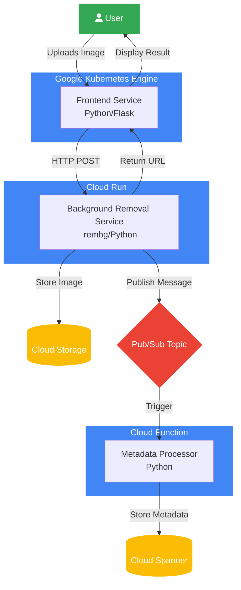
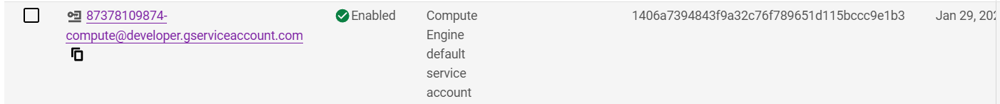
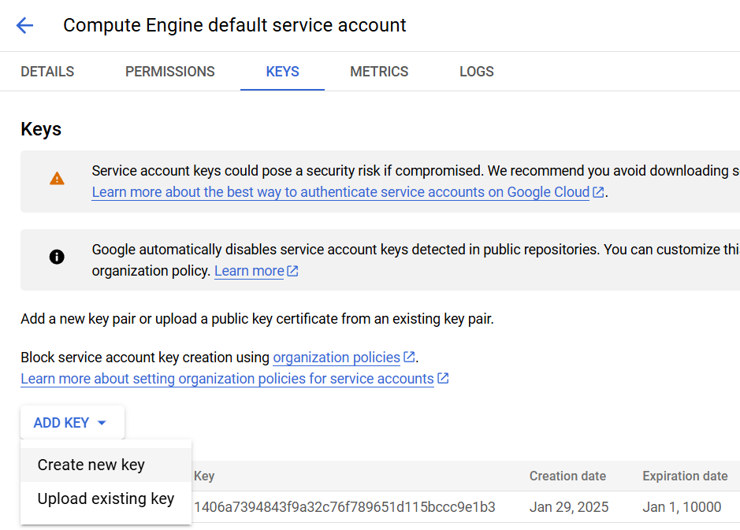

# Background Removal Service Lab

A complete Google Cloud Platform setup for an image processing service that removes backgrounds from images using `rembg` library, demonstrating the integration of GKE, Cloud Run, Cloud Functions, Pub/Sub, and Cloud Spanner.


## Project Structure
```
.
├── README.md
└── code/
    ├── Makefile                # Build and deployment automation
    ├── bg-remove/             # Cloud Run background removal service
    │   ├── Dockerfile
    │   ├── app.py            # Image processing logic
    │   └── requirements.txt
    ├── frontend/             # GKE frontend application
    │   ├── Dockerfile
    │   ├── app.py           # Frontend web interface
    │   ├── deployment.yaml  # Kubernetes manifests
    │   └── requirements.txt
    ├── infra/               # Terraform infrastructure code
    │   ├── credentials.json
    │   ├── main.tf
    │   ├── outputs.tf
    │   ├── variables.tf
    │   └── terraform.tfvars
    └── metadata_processor/   # Cloud Function for metadata
        └── main.py
```

## Prerequisites

1. All those tools are needed and installed(all but gcloud):
   - Docker
   - Terraform >= 1.0
   - `gcloud` CLI
   - `kubectl`

  :
   **Install gcloud**:
   ```
   curl -sSL https://sdk.cloud.google.com > /tmp/gcl && bash /tmp/gcl --install-dir=~/gcloud --disable-prompts
   echo "PATH=$PATH:~/gcloud/google-cloud-sdk/bin" >> ~/.bashrc
   ```
   > Open a new terminal and you'll be ready to start.

**Create a service account key**
- Identify your default sevice account:



- Open it and create a JSON key


- Copy this key and paste the content in a file that you'll store at code/infra/credentials.json


2. Set up Google Cloud authentication:
```bash
# Use existing credentials
gcloud auth activate-service-account --key-file=code/infra/credentials.json

# Or login interactively
gcloud auth login
gcloud config set project $(terraform -chdir=code/infra output -raw project_id)
```

## Deployment Steps

### 1. Infrastructure Deployment

Deploy the base infrastructure using Terraform:
```bash
cd code/infra
terraform init
terraform plan
terraform apply
```

### 2. Build and Push Docker Images

Build and push both the background removal service and frontend:
```bash
cd code

# Build and push background removal service
docker build -t gcr.io/${PROJECT_ID}/bg-remove:latest bg-remove/
docker push gcr.io/${PROJECT_ID}/bg-remove:latest

#auth to the registry gcr
gcloud auth activate-service-account --key-file=infra/credentials.json
gcloud auth configure-docker gcr.io
sudo docker login -u _json_key_ --password-stdin < infra/credentials.json 

# Build and push frontend
docker build -t gcr.io/${PROJECT_ID}/frontend:latest frontend/
docker push gcr.io/${PROJECT_ID}/frontend:latest
```

### 3. Deploy to GKE

Get cluster credentials and deploy the frontend:
```bash
# Get cluster credentials
gcloud container clusters get-credentials $(terraform -chdir=code/infra output -raw gke_cluster_name) \
    --zone $(terraform -chdir=code/infra output -raw zone) \
    --project $(terraform -chdir=code/infra output -raw project_id)

# Deploy frontend
kubectl apply -f code/frontend/deployment.yaml
```

## Using the Makefile

The project includes a Makefile to automate common tasks:
```bash
cd code

# Build all images
make build

# Push all images
make push

# Deploy infrastructure
make deploy-infra

# Deploy applications
make deploy-apps

# Deploy everything
make deploy-all

# Clean up
make clean
```

## Testing

1. Get the frontend service IP:
```bash
kubectl get service frontend -o jsonpath="{.status.loadBalancer.ingress[0].ip}"
```

2. Open the IP address in your browser
3. Upload an image to test the background removal

## Monitoring

View logs for different components:
```bash
# Background removal service (Cloud Run)
gcloud logging read "resource.type=cloud_run_revision AND resource.labels.service_name=bg-remove"

# Metadata processor (Cloud Function)
gcloud logging read "resource.type=cloud_function AND resource.labels.function_name=process-metadata"

# Frontend (GKE)
kubectl logs -l app=frontend
```

## Clean Up

Remove all deployed resources:
```bash
# Remove Kubernetes resources
kubectl delete -f code/frontend/deployment.yaml

# Remove infrastructure
cd code/infra
terraform destroy
```

## Development

### Local Testing

Test components locally:

1. Background Removal Service:
```bash
cd code/bg-remove
docker build -t bg-remove:local .
docker run -p 8080:8080 bg-remove:local
```

2. Frontend:
```bash
cd code/frontend
docker build -t frontend:local .
docker run -p 8081:8080 frontend:local
```

### Making Changes

1. Update background removal service:
```bash
cd code/bg-remove
docker build -t gcr.io/${PROJECT_ID}/bg-remove:latest .
docker push gcr.io/${PROJECT_ID}/bg-remove:latest
```

2. Update frontend:
```bash
cd code/frontend
docker build -t gcr.io/${PROJECT_ID}/frontend:latest .
docker push gcr.io/${PROJECT_ID}/frontend:latest
kubectl rollout restart deployment frontend
```

## Troubleshooting

### Common Issues

1. Image Processing Errors
   - Check Cloud Run logs
   - Verify memory allocation
   - Check service account permissions

2. Frontend Connection Issues
   - Verify GKE cluster network policies
   - Check service URLs in configuration
   - Verify IAM permissions

3. Metadata Processing Issues
   - Check Pub/Sub message delivery
   - Verify Cloud Function logs
   - Check Spanner access

### Debug Commands
```bash
# Check GKE cluster status
kubectl get nodes
kubectl get pods
kubectl describe pod <pod-name>

# Check Cloud Run service
gcloud run services describe bg-remove

# View detailed logs
kubectl logs -l app=frontend --tail=100
gcloud logging tail "resource.type=cloud_run_revision"
```
